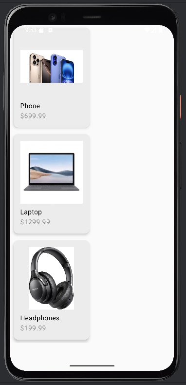
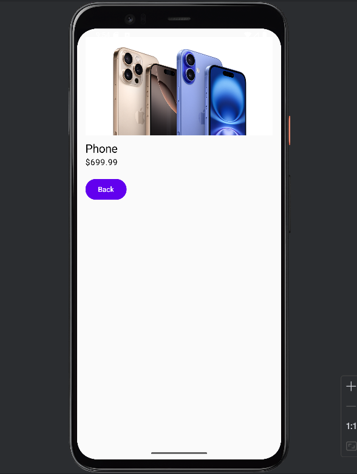

# 📱 Catalogue de Produits - Android App

Bienvenue dans **Catalogue Produits**, une application mobile développée avec **Jetpack Compose** et **Kotlin**, qui permet de consulter une liste de produits et d’en afficher les détails.

---

## 👨‍💻 Dev

**Morad Oulhaj**  
_Master DevOps & Cloud Computing_

---

## ✨ Fonctionnalités principales

- 🛒 Affichage d’une **liste de produits**
- 🔍 Navigation vers les **détails d’un produit**
- 🖼️ Chargement dynamique des **images**
- 💰 Affichage du **prix** 

---

## 🧩 Technologies & Dépendances

Ce projet utilise les bibliothèques suivantes :

- ⚙️ [Jetpack Compose](https://developer.android.com/jetpack/compose) — pour la construction de l’UI déclarative
- 🧭 [Navigation Compose](https://developer.android.com/jetpack/compose/navigation) — pour la navigation entre les écrans

## Additional Dependencies Added

These dependencies were explicitly added to support Jetpack Compose UI, Material3, and Navigation:

```kotlin
// Compose UI libraries
implementation("androidx.compose.ui:ui")
implementation("androidx.compose.ui:ui-graphics")
implementation("androidx.compose.ui:ui-tooling-preview")
implementation("androidx.compose.runtime:runtime")

// Material Design 3 components for Compose
implementation("androidx.compose.material3:material3")

// Navigation component for Compose
implementation("androidx.navigation:navigation-compose:2.7.5")

// Debug and testing tools for Compose
debugImplementation("androidx.compose.ui:ui-tooling")
debugImplementation("androidx.compose.ui:ui-test-manifest")
androidTestImplementation(platform("androidx.compose:compose-bom:<version>"))
androidTestImplementation("androidx.compose.ui:ui-test-junit4")

## 🧩Screenshots

### Catalog View


### Product Details

