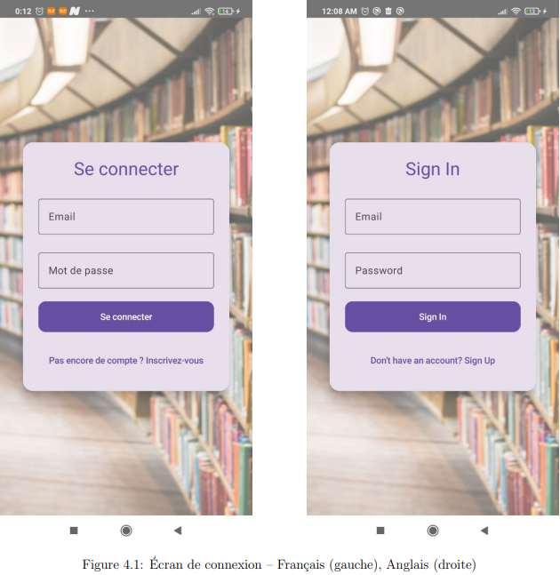
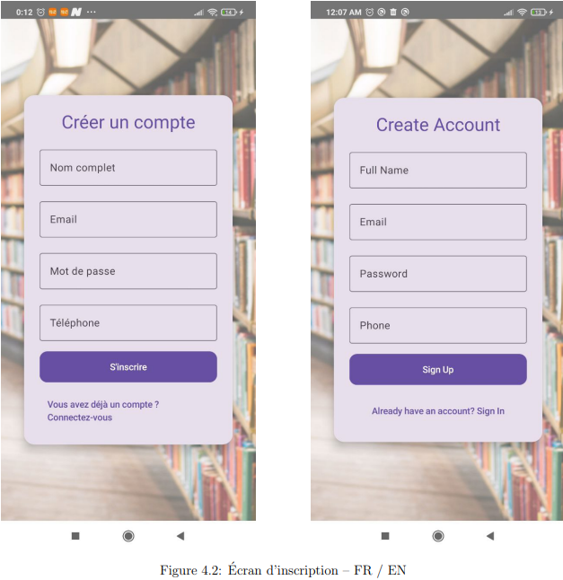
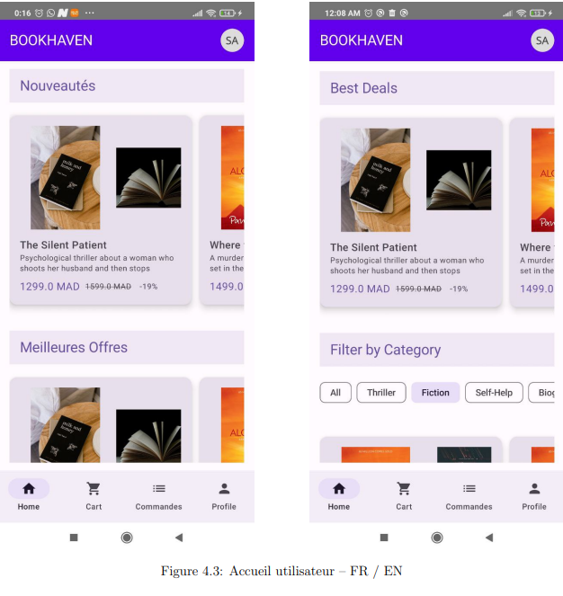
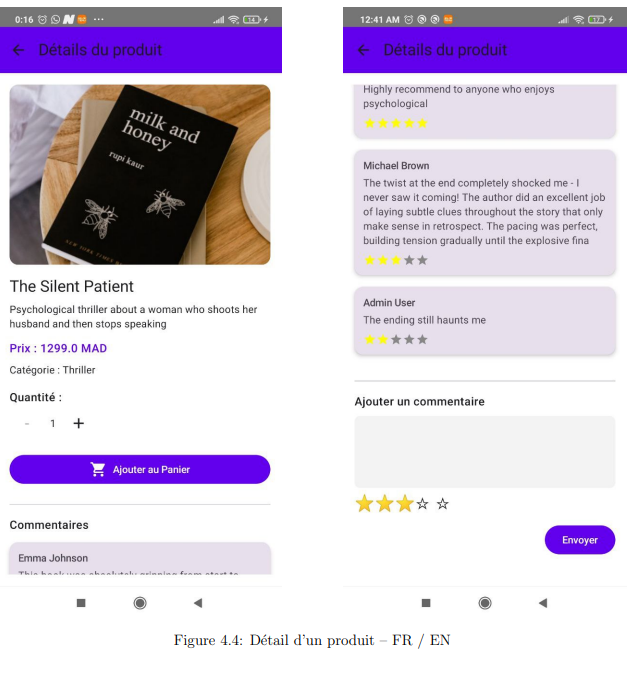
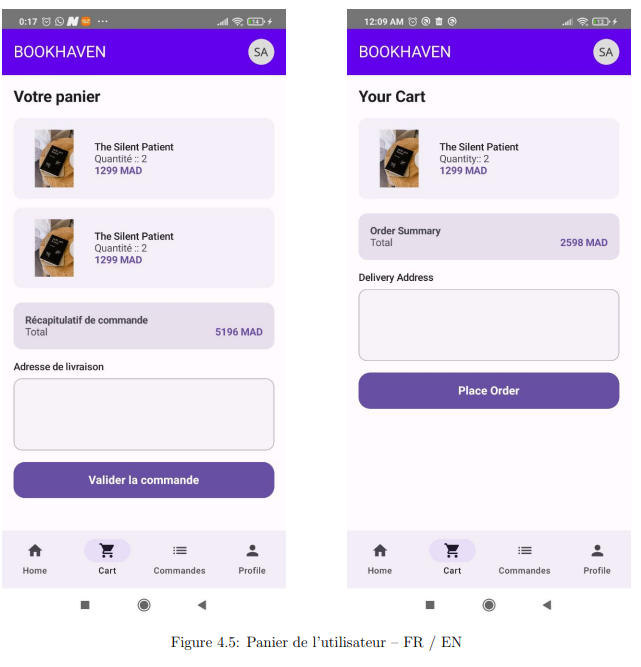
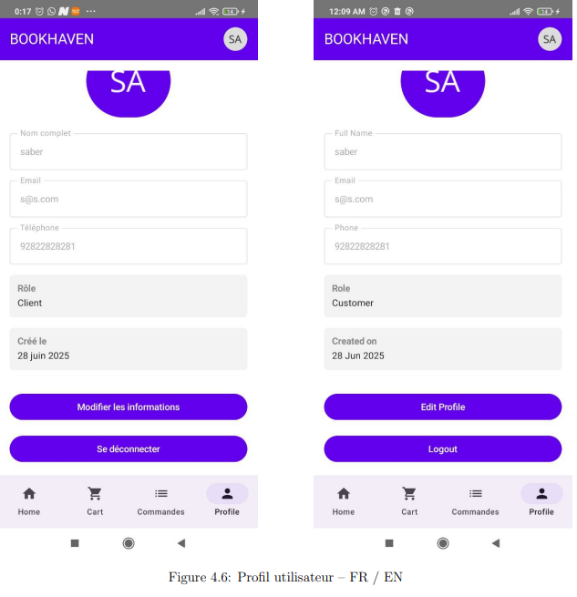
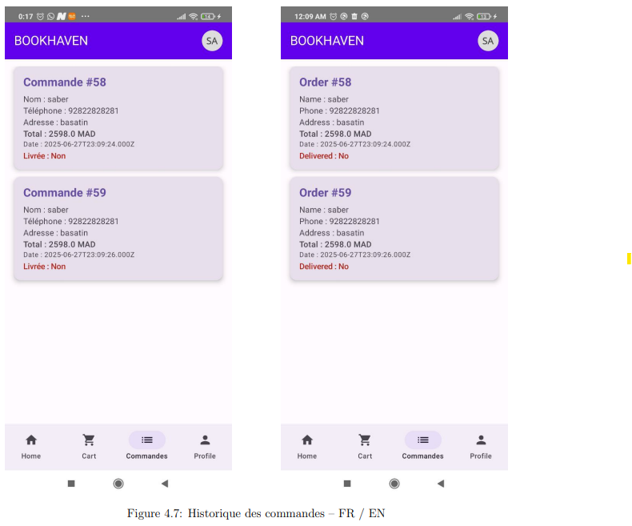

# 📱 BOOK Haven – Application Mobile Kotlin (Jetpack Compose)

BOOK Haven est une application e-commerce mobile native développée avec **Kotlin** et **Jetpack Compose**.  
Elle permet aux utilisateurs de consulter des livres, gérer leur panier, passer commande et modifier leur profil, le tout dans une interface fluide, bilingue (🇫🇷 / 🇺🇸) et moderne.

---

## ✨ Fonctionnalités Clés

L'application mobile propose une expérience complète côté utilisateur :

### 👤 Gestion Utilisateur
- 🔐 **Connexion / Inscription sécurisées** avec JWT
- 👋 **Déconnexion** et suppression des données locales
- 🧑 **Profil personnalisable**
- 🌐 **Internationalisation automatique** en fonction de la langue du système (🇫🇷 Français / 🇺🇸 Anglais)

### 📚 Navigation Produits
- 🏠 **Page d'accueil** avec nouveautés et meilleures offres
- 🔍 **Liste des livres** par catégorie
- 📖 **Détail produit** avec image, prix et description
- ❤️ **Ajout au panier** en un clic

### 🛒 Panier & Commande
- 📦 **Consultation et modification du panier**
- ➖ **Suppression d’un article**
- ✅ **Validation de commande**
- 📜 **Historique des commandes**

---

## 🧱 Stack Technique

| Composant             | Technologie utilisée          |
|-----------------------|-------------------------------|
| UI                    | Jetpack Compose               |
| Architecture          | MVI (Model - View - Intent)   |
| Navigation            | Navigation Compose            |
| DI                    | Hilt                          |
| API REST              | Retrofit              |
| Stockage local        | DataStore (clé, token JWT)    |
| Chargement images     | Coil                          |
| i18n                  | strings.xml / strings-fr.xml  |

---

## 📁 Structure du projet
```bash

├── ui/
│ ├── Login/
│ ├── Signup/
│ ├── Home/
│ ├── ProductList/
│ ├── Cart/
│ ├── Profile/
│ ├── Order/
│ └── utilsUI/ (composants réutilisables)
├── data/
│ ├── model/
│ ├── network/
│ ├── repository/
│ └── datastore/
├── nav/
│ └── AppRootNavigation.kt
├── theme/
├── MyApp.kt
└── MainActivity.kt
```
---

## 🚀 Lancer l’application (mode développement)

## 🔧 Backend – Serveur Node.js

Le backend de l'application est basé sur le dépôt suivant :  
👉 [`sangnguyen190997/shopping-ecommerce`](https://github.com/sangnguyen190997/shopping-ecommerce/tree/master/backend)

### ✅ Étapes essentielles :

```bash
# 1. Cloner le dépôt
git clone https://github.com/sangnguyen190997/shopping-ecommerce.git
cd shopping-ecommerce/backend

# 2. Installer les dépendances
npm install

# 3. Lancer le serveur
node index.js
```

ℹ️ Les autres étapes détaillées de configuration sont disponibles dans le README original du backend et dans le rapport fourni avec ce projet.
## 🔧 Mobile – Kotlin

### Prérequis
- Android Studio (Flamingo+)
- Kotlin 1.9+
- Émulateur Android ou smartphone

### Étapes

```bash
# 1. Cloner le projet
git clone https://github.com/moradoulhaj/TP-Android-MoradOulhaj
cd TP-Android-MoradOulhaj

# 2. Ouvrir avec Android Studio

# 3. Lancer l’application sur un émulateur ou appareil connecté

# ✅ L’application s’adapte automatiquement à la langue du système (français / anglais)
```
## 📱 Screenshots – Application Mobile Kotlin

### 🔐 Connexion (Login)
<p align="center">
  
</p>

---

### 📝 Inscription (Signup)
<p align="center">
  
</p>

---

### 🏠 Accueil Utilisateur
<p align="center">
  
</p>

---

### 📖 Détail Produit
<p align="center">
  
</p>

---

### 🛒 Panier
<p align="center">
  
</p>

---

### 👤 Profil Utilisateur
<p align="center">
  
</p>

---

### 📜 Historique des Commandes
<p align="center">
  
</p>

